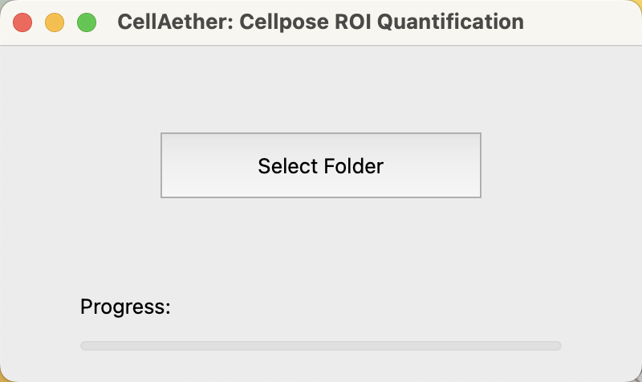

# CellAether

CellAether is a plugin of [cellpose2](https://github.com/MouseLand/cellpose) for quantifying ROI area, pixel intensity from non-stiched 3-D segmentations.

Currently this is developed for internal use in the [Clowney Lab](https://sites.lsa.umich.edu/clowney-lab/). Appologize in advance for typos and poor documentation. Suggestions are welcome!

## Installation

To use this plugin, we assume you have [cellpose2](https://github.com/MouseLand/cellpose) installed and have a conda environment named ```cellpose``` ready. While it's not necessary, it will be convenient to have CellAether and cellpose installed in the same environment.

If you are not familiar with conda enviroment or cellpose, please check their documentation:

- [Anaconda](https://conda.io/projects/conda/en/latest/user-guide/getting-started.html#managing-python)
- [cellpose]((https://github.com/MouseLand/cellpose))

First of all we need to activate the conda enviroment you want to install CellAether in by running

```bash
conda activate cellpose
```

*replace 'cellpose' with the environment name you want install CellAether in.*

If you have [git](https://git-scm.com/book/en/v2/Getting-Started-Installing-Git) installed, go to [git clone](#git-clone). Alternatively, go to [download CellAether](#download-cellaether)

### git clone

If you have git installed on your computer you can install CellAether by running:

```bash
git clone https://github.com/Yiijee/CellAether.git
cd CellAether
pip install .
```

### download CellAether

If you don't have git installed, you can download CellAether by clicking the green **"<> code"** button on the top-right corner of this page, then choose **"download zip"**.

CellAether will be installed by running:

```bash
cd path/to/downloaded/CellAether
pip install .
```

*remember to replace ```path/to/downloaded/CellAether``` with your actual downloading path*

## Uasge

CellAether is easy to use. To open CellAether, you need to activate the enviroment first:

```bash
conda activate cellpose
```

Then simply type the name of this package:

```bash
CellAether
```

And you should see a simple GUI pop up like following. It may take 20 sec for the first time.



Then you can click the "Select Folder" button and nagivate to the folder the tiff images and corresponding _seg.npy files. Once you clicked "open", CellAether will process all pairs of image files and _seg.npy files it can find in the folder, and save the results with as ```image_name.csv``` in the same folder. Once all files is done, it will show ```'xxx_folder' is done```. And you can click "Select Folder" again and start process of next folder.

For image file with n Channels and m ROIs, the result csv file is structured as:

|ROI_ID| ROI_area | Chan_1 | Chan_2 | Chan_... | Chan_n |
|--|--|--|--|--|--|
|1|100|110|9988|...|7|
|...|...|...|...|...|...|
|m|140|210|3000|...|12|

- ROI_ID: same ID in cellpose GUI
- ROI_area: area of the ROI, unit in pixels
- Chan_n: sum of pixel intensity within the ROI

To close this app, just click the red "x" on top-left.
